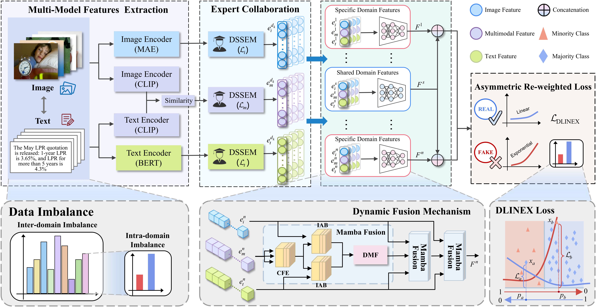

# IECDF: Imbalanced Multi-Domain Multi-Modal Learning with Expert Collaboration and Dynamic Fusion Mechanism for Fake News Detection

[](https://dl.acm.org/doi/10.1145/3816245)

> Official implementation of **IECDF**, a multi-domain multi-modal fake news detection framework designed for triple imbalance: **domain imbalance**, **modality imbalance**, and **class imbalance**.

<p align="center">
  
</p>

## 📰 Introduction

IECDF addresses triple imbalance in multi-domain multi-modal fake news detection through expert collaboration, dynamic fusion, and asymmetric re-weighted learning.

## 🧩 Framework

<p align="center">
  
</p>

The overall framework of IECDF consists of three main components: an expert collaboration module for domain imbalance, a dynamic fusion module for modality imbalance, and DLINEX loss for class imbalance.

## 📁 Repository Structure

```text
.
├── main.py                 # training entry
├── test.py                 # testing entry
├── dataset/                # dataloaders
├── model/                  # IECDF model and losses
└── utils/                  # metrics and utilities
```

## 🔧 Dependencies and Installation

```bash
conda create -n IECDF python=3.10
conda activate IECDF

pip install -r requirements.txt
```

The main required packages are listed in `requirements.txt`.

## ⏬ Prepare Checkpoints

Please prepare the pretrained checkpoints required by the code before training:

- BERT / RoBERTa text encoder
- MAE visual backbone
- CLIP / CN-CLIP model

## ⏬ Prepare Data

Please prepare the processed multimodal data and features following the dataloader format used in this repository.


## 🤗 Acknowledgements

We sincerely thank the authors of the related datasets, pretrained models, and open-source projects.
